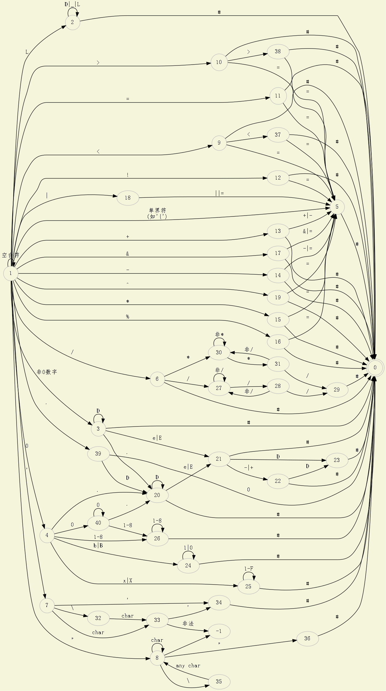

# readme

#### 源文件

源文件为source.cpp

编译出来的程序为source.exe

#### 使用方法

此时并未完成预处理的工作，如#等内容并未完成，需要对输入文件进行处理，将所有预编译的内容清除。

程序的输入为文件名 如: demo.c

程序的输出为tokens.txt，其中包含对单词的分析以及代号的转换，所处的行数。

#### 程序功能

程序能够识别C语言的输入文件。

该词法分析器能够实现字符与字符串的识别，注释的识别，多进制实数与小数的识别，标识符和关键字，界符和运算符的识别，基本包含了大部分的C所支持的内容。

#### token与代号的对应关系如下所示：

| sources    | code | sources  | code | sources | code | sources | code |
| ---------- | ---- | -------- | ---- | ------- | ---- | ------- | ---- |
| notes      | 0    | volatile | 22   | */      | 44   | %=      | 66   |
| constants  | 1    | void     | 23   | //      | 45   | <<      | 67   |
| char       | 2    | if       | 24   | '       | 46   | <<=     | 68   |
| string     | 3    | else     | 25   | "       | 47   | >>      | 69   |
| identifier | 4    | switch   | 26   | <       | 48   | >>=     | 70   |
| auto       | 5    | case     | 27   | <=      | 49   | &       | 71   |
| short      | 6    | for      | 28   | >       | 50   | &=      | 72   |
| int        | 7    | do       | 29   | >=      | 51   | &&      | 73   |
| long       | 8    | while    | 30   | ==      | 52   | \|      | 74   |
| float      | 9    | goto     | 31   | !=      | 53   | \|=     | 75   |
| double     | 10   | continue | 32   | =       | 54   | \|\|    | 76   |
| char       | 11   | break    | 33   | +       | 55   | ^       | 77   |
| struct     | 12   | default  | 34   | ++      | 56   | ^=      | 78   |
| union      | 13   | sizeof   | 35   | +=      | 57   | ,       | 79   |
| enum       | 14   | return   | 36   | -       | 58   | ?       | 80   |
| typedef    | 15   | {        | 37   | --      | 59   | :       | 81   |
| const      | 16   | }        | 38   | -=      | 60   | !       | 82   |
| unsigned   | 17   | (        | 39   | *       | 61   | ~       | 83   |
| signed     | 18   | )        | 40   | *=      | 62   | ;       | 84   |
| externed   | 19   | [        | 41   | /       | 63   | .       | 85   |
| register   | 20   | ]        | 42   | /=      | 64   |         |      |
| static     | 21   | /*       | 43   | %       | 65   |         |      |

#### 实现的自动机如下所示

